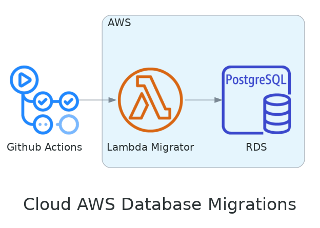

# Fast-Food Database

This project its responsible for provisioning a database in AWS using Terraform. The database will be a PostgreSQL instance and it will be created in a VPC. The database will be created in a private subnet and it will be accessed by a lambda function that will be responsible for running the database migrations.

## Diagram

## Terraform

Bellow it is described all the resources used to create the architecture proposed for this project.

<!-- BEGIN_TF_DOCS -->

## Requirements

| Name | Version |
|------|---------|
|  [terraform](#requirement\_terraform) | 1.7.4 |
|  [aws](#requirement\_aws) | 5.38.0 |
## Providers

No providers.
## Inputs

| Name | Description | Type | Default | Required |
|------|-------------|------|---------|:--------:|
|  [region](#input\_region) | The default region to use for AWS | `string` | `"us-east-1"` | no |
|  [tags](#input\_tags) | The default tags to use for AWS resources | `map(string)` | <pre>{   "App": "lambda" }</pre> | no |
|  [vpc\_name](#input\_vpc\_name) | The name of the VPC | `string` | `"vpc-fastfood"` | no |
## Modules

| Name | Source | Version |
|------|--------|---------|
|  [migrator](#module\_migrator) | ./modules/migrator | n/a |
## Resources

No resources.
## Outputs

No outputs.
<!-- END_TF_DOCS -->

## Modules

- [database](./docs/database.md)
- [migrator](./docs/migrator.md)