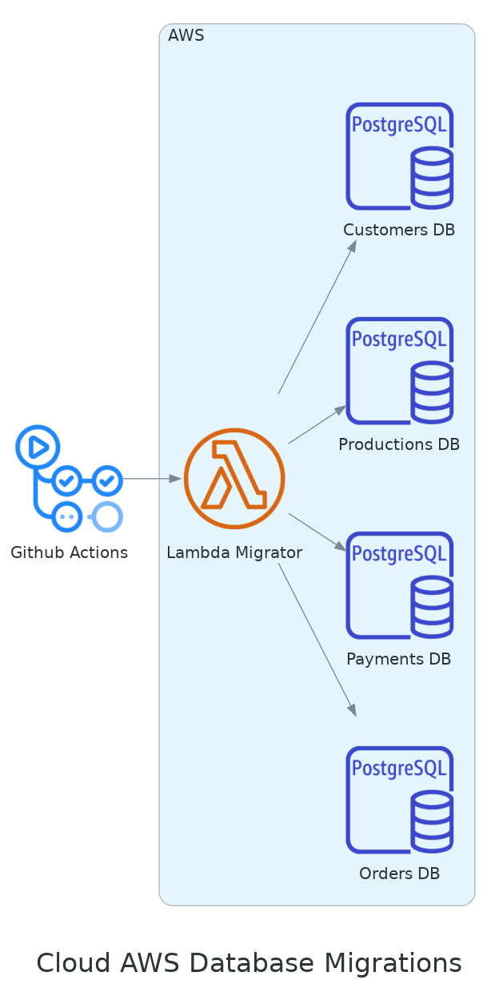

# Fast-Food Database Provisioning

This project its responsible for provisioning a database in AWS using Terraform. The database will be a PostgreSQL instance and it will be created in a VPC. The database will be created in a private subnet and it will be accessed by a lambda function that will be responsible for running the database migrations.

## Diagram

## Terraform

Bellow it is described all the resources used to create the architecture proposed for this project.

<!-- BEGIN_TF_DOCS -->

## Requirements

| Name | Version |
|------|---------|
|  [terraform](#requirement\_terraform) | 1.7.4 |
|  [aws](#requirement\_aws) | 5.38.0 |
## Providers

| Name | Version |
|------|---------|
|  [aws](#provider\_aws) | 5.38.0 |
|  [random](#provider\_random) | 3.6.0 |
## Inputs

| Name | Description | Type | Default | Required |
|------|-------------|------|---------|:--------:|
|  [bucket\_name](#input\_bucket\_name) | The name of the S3 bucket to store the tfstate file | `any` | n/a | yes |
|  [database\_name](#input\_database\_name) | The name of the database | `string` | `"fastfood"` | no |
|  [database\_port](#input\_database\_port) | The port the database will listen on | `number` | `5432` | no |
|  [lambda\_name](#input\_lambda\_name) | The name of the lambda function | `string` | `"lambda_migrator"` | no |
|  [project\_name](#input\_project\_name) | The name of the project | `string` | `"fastfood"` | no |
|  [region](#input\_region) | The default region to use for AWS | `string` | `"us-east-1"` | no |
|  [tags](#input\_tags) | The default tags to use for AWS resources | `map(string)` | <pre>{   "App": "database" }</pre> | no |
## Modules

| Name | Source | Version |
|------|--------|---------|
|  [db](#module\_db) | terraform-aws-modules/rds/aws | 5.9.0 |
|  [vpc](#module\_vpc) | terraform-aws-modules/vpc/aws | 5.5.2 |
## Resources

| Name | Type |
|------|------|
| [aws_iam_policy_attachment.iam_role_policy_attachment_vpc](https://registry.terraform.io/providers/hashicorp/aws/5.38.0/docs/resources/iam_policy_attachment) | resource |
| [aws_iam_policy_attachment.lambda_policy_attachment](https://registry.terraform.io/providers/hashicorp/aws/5.38.0/docs/resources/iam_policy_attachment) | resource |
| [aws_iam_role.lambda_role](https://registry.terraform.io/providers/hashicorp/aws/5.38.0/docs/resources/iam_role) | resource |
| [aws_lambda_function.lambda_function](https://registry.terraform.io/providers/hashicorp/aws/5.38.0/docs/resources/lambda_function) | resource |
| [aws_secretsmanager_secret.superuser](https://registry.terraform.io/providers/hashicorp/aws/5.38.0/docs/resources/secretsmanager_secret) | resource |
| [aws_secretsmanager_secret_version.superuser](https://registry.terraform.io/providers/hashicorp/aws/5.38.0/docs/resources/secretsmanager_secret_version) | resource |
| [aws_security_group.security_group](https://registry.terraform.io/providers/hashicorp/aws/5.38.0/docs/resources/security_group) | resource |
| [random_password.password](https://registry.terraform.io/providers/hashicorp/random/latest/docs/resources/password) | resource |
| [random_pet.users](https://registry.terraform.io/providers/hashicorp/random/latest/docs/resources/pet) | resource |
| [aws_availability_zones.available](https://registry.terraform.io/providers/hashicorp/aws/5.38.0/docs/data-sources/availability_zones) | data source |
| [aws_kms_alias.secretsmanager](https://registry.terraform.io/providers/hashicorp/aws/5.38.0/docs/data-sources/kms_alias) | data source |
| [aws_s3_bucket.bucket](https://registry.terraform.io/providers/hashicorp/aws/5.38.0/docs/data-sources/s3_bucket) | data source |
## Outputs

No outputs.
<!-- END_TF_DOCS -->